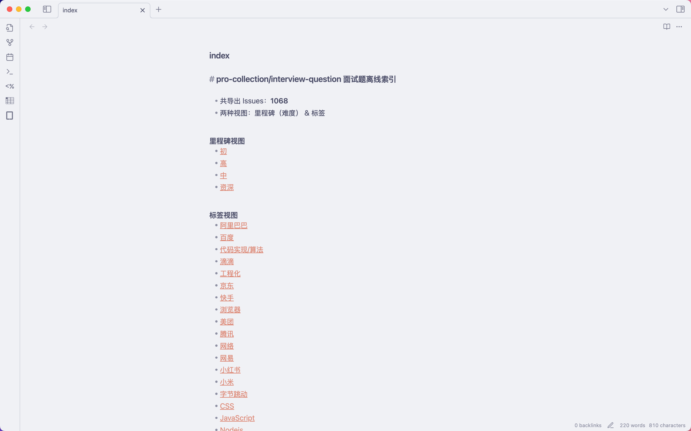
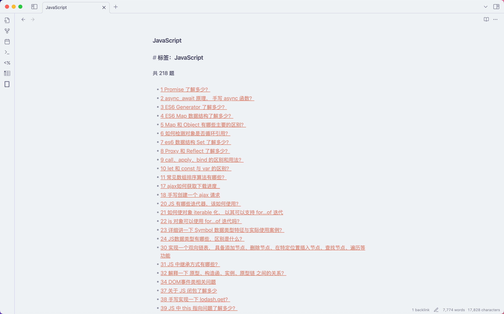

# Get Interview Questions

将 GitHub 仓库中的 Issues 导出为 **适配 Obsidian 的 Markdown 题库**。  
支持按 **标签（Labels）** 和 **里程碑（Milestones）** 分类浏览，保留完整排版和代码块，并自动生成 **双链导航** 方便在 Obsidian 中跳转。

> ⚠️ **数据来源**  
> 本工具默认抓取 [pro-collection/interview-question](https://github.com/pro-collection/interview-question) 仓库的前端面试题。  
> 所有题目内容版权归原仓库及其贡献者所有，本项目仅提供离线导出与浏览功能，不对原题目内容拥有任何权利。

---

## ✨ 功能特点

- **Markdown 输出**：保留原有排版、代码块、图片。
- **Obsidian 双链**（`[[...]]`）：题目与索引之间可双向跳转。
- **双视图**：
  - **按里程碑**：通常用于难度分级。
  - **按标签**：按题型或知识点分类。
- **文件命名**：  
  `issues/序号. 标题.md`，在文件树中直观可见题目标题。
- **支持 `.env` 配置**：设置 GitHub Token、仓库信息等。
- **支持 pnpm/npm/yarn 一键运行**。

---

## 📦 安装

```bash
git clone https://github.com/ZyXianzi/get-interview-questions.git
cd get-interview-questions
pnpm install
````

---

## ⚙️ 配置（可选）

在项目根目录创建 `.env` 文件：

```env
# GitHub Personal Access Token（建议配置，提高接口速率限制）
GH_TOKEN=[your_github_token]

# 默认仓库信息（可在命令行覆盖）
OWNER=pro-collection
REPO=interview-question

# 输出目录
OUT_DIR=out
```

> 🔑 **Token 权限**：公共仓库只需 `public_repo` 权限即可。

---

## 🚀 使用方法

### 1. 使用 `.env` 中的默认配置

```bash
pnpm run export
```

### 2. 手动指定仓库和输出目录

```bash
pnpm run export:custom owner-name repo-name output-directory
```

运行完成后，`OUT_DIR` 目录下会生成完整题库。

---

## 📂 导出目录结构

```
out/
├─ issues/
│  ├─ 1. Promise 了解多少.md
│  ├─ 2. async/await 原理， 手写 async 函数？.md
│  └─ ...
├─ by-label/
│  ├─ JavaScript.md
│  ├─ CSS.md
│  └─ ...
├─ by-milestone/
│  ├─ 初.md
│  ├─ 中.md
│  └─ ...
└─ index.md
```

* **`issues/`**：每道题一个 Markdown 文件，包含完整题干与内容。
* **`by-label/`**：按标签分类的索引页。
* **`by-milestone/`**：按里程碑分类的索引页。
* **`index.md`**：总目录页，包含两种视图入口。

---

## 🖼 在 Obsidian 中浏览

* 将 `out/` 文件夹添加到 Obsidian Vault 中。
* 打开 `index.md` 即可开始按标签或里程碑浏览题目。
* 所有跳转均为 Obsidian 双链，支持反向链接和搜索。






---

## 📜 许可证

本项目代码使用 [MIT License](LICENSE) 开源。

> **重要说明**：所有题目内容版权归 [pro-collection/interview-question](https://github.com/pro-collection/interview-question) 及其贡献者所有。
> 本工具仅提供导出与本地浏览功能，不对原内容主张任何权利，也不对内容的准确性负责。

---

## 🙏 致谢

* [pro-collection/interview-question](https://github.com/pro-collection/interview-question) – 题库来源。
* [Octokit](https://github.com/octokit/octokit.js) – GitHub API 客户端。
* [ChatGPT](https://chatgpt.com/) - 主要代码由GPT 5生成
